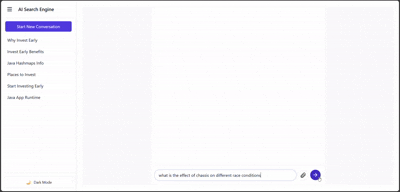

# 🔍 Perplexity-Style AI Search Engine (Streaming RAG)

A **citation-first, Perplexity-style AI search engine** built end-to-end with a streaming Retrieval-Augmented Generation (RAG) backend and a calm, research-focused frontend.

The system enables users to upload PDFs and ask questions grounded **strictly in their documents**, with real-time streaming responses, observable tool execution, and seamless citation-to-PDF navigation.

Repository structure:

```
├── backend/   # FastAPI + RAG + SSE streaming
└── frontend/  # Next.js 14 Perplexity-style UI
```

---

## ✨ Key Features

### Backend
- Chat-first RAG architecture (conversations + messages)
- Server-Sent Events (SSE) for real-time token streaming
- Explicit, observable tool orchestration (search → read → generate)
- PDF-aware ingestion with page-level and offset-level metadata
- Citation-ready responses with structured citation maps
- Asynchronous document ingestion pipeline using workers

### Frontend
- Perplexity-inspired streaming chat interface
- Real-time tool call indicators
- Inline citations with source cards
- Animated transition to PDF viewer with highlighted sections
- Mobile-first responsive layout
- Architecture ready for generative UI components (tables, charts)

---

## 🏗️ Architecture Overview

### High-Level System Flow


### Streaming & Orchestration Flow


### Sequence Diagram


---

## 📡 Streaming Protocol (SSE)

Streaming happens via:

```
GET /chat/{conversation_id}/stream
```

**Supported Event Types:**
- `typing`
- `tool_call_started`
- `tool_call_finished`
- `text_delta`
- `citation_map`
- `citation`
- `info`
- `error`
- `done`

Events are streamed incrementally and rendered progressively by the frontend.

---

## 📂 API Endpoints

### Documents
- `POST /upload` – Upload PDF and enqueue ingestion
- `GET /documents/{doc_id}/pdf` – Serve original PDF

### Chat
- `POST /chat` – Create conversation and send message
- `GET /chat/{conversation_id}/stream` – SSE stream

### Conversations
- `GET /conversations` – List conversations
- `GET /conversations/{conversation_id}/history` – Message history

---

## 🖼️ Screenshots / GIFs

- Tool call streaming in action
  
- Citation → PDF viewer transition
  
- Dark mode + Mobile-first
  

---

## 🧰 Libraries Used

### Backend
| Library                | Version   | Purpose                        |
|------------------------|-----------|--------------------------------|
| FastAPI                | ≥ 0.110   | Async API + SSE                |
| Python                 | 3.11+     | Performance, typing            |
| Redis                  | 7+        | Queue + streaming backbone     |
| Qdrant                 | Latest    | Vector similarity search       |
| SentenceTransformers   | all-MiniLM-L6-v2 | Fast semantic embeddings |
| pdfplumber             | Latest    | Page-level PDF text extraction |
| Supabase (Postgres)    | Hosted    | Metadata persistence           |
| Google Gemini API      | Latest    | Streaming LLM responses        |

### Frontend
| Library                | Version   | Purpose                        |
|------------------------|-----------|--------------------------------|
| Next.js                | 14+       | App Router, performance        |
| TypeScript             | Strict    | Safety for streaming logic     |
| Tailwind CSS           | Latest    | Styling                        |
| Zustand                | Latest    | Global state                   |
| TanStack Query         | Latest    | REST data fetching             |
| Framer Motion          | Latest    | Subtle animations              |
| react-pdf / pdf-viewer | Latest    | PDF rendering                  |

---

## ⚙️ Setup Instructions

### Backend
```sh
cd backend
python -m venv venv
source venv/bin/activate
pip install -r requirements.txt
```

Start Redis:
```sh
redis-server
```

Run backend:
```sh
uvicorn main:app --reload
```

### Frontend
```sh
cd frontend
npm install
npm run dev
```

---

## 🔐 Environment Variables

### Backend (`backend/.env`)
```
REDIS_URL=redis://localhost:6379
QDRANT_URL=https://<your_qdrant_project_id>.us-east4-0.gcp.cloud.qdrant.io
QDRANT_API_KEY=
SUPABASE_URL=https://<your_supabase_project_id>.supabase.co
SUPABASE_KEY=
GOOGLE_GENAI_API_KEY=
GOOGLE_GENAI_USE_VERTEXAI=
FRONTEND_ORIGIN=http://localhost:3000,http://127.0.0.1:3000,localhost:3000,127.0.0.1:3000
```

### Frontend (`frontend/.env.local`)
```
NEXT_PUBLIC_API_BASE_URL=http://localhost:8000
```

---

## ▶️ Running Locally

1. Start Redis
2. Start backend
3. Start frontend
4. Open [http://localhost:3000](http://localhost:3000)

---

## 🧠 Design Decisions

### Chat-First RAG Architecture
- The system is built around conversations and messages, not single-shot queries. This allows:
  - Context-aware follow-ups
  - Persisted chat history
  - Natural extension to memory or summarization

### Explicit Tool Orchestration
- Instead of hiding retrieval inside the LLM call:
  - Each step (searching, reading, answering) is explicit
  - Tool execution is observable via SSE
  - The UI can reflect system behavior transparently

### Citation-First Design
- Citations are treated as structured data:
  - Stored separately from text
  - Include document ID, page number, and offsets
  - Enable accurate PDF highlighting and navigation

### Streaming as a First-Class Concern
- The system is designed around incremental output:
  - Token-level streaming from the LLM
  - Progressive UI updates
  - No blocking on full responses

---

## ⚖️ Trade-offs & Future-Proofing

The following capabilities are intentionally designed for, but not fully implemented yet due to time constraints:

### Event Replay
- **Planned:** Durable replay of SSE events on reconnect
- **Current state:** Streaming works live, architecture supports replay
- **Future:** Enable full Redis Stream replay for refresh safety

### Retry Mechanism (Document Uploads)
- **Planned:** Automatic retries for failed ingestion jobs
- **Current state:** Upload + ingestion is best-effort
- **Future:** Worker-level retries with idempotency guarantees

### Rate Limiting
- **Planned:** Per-user or per-conversation throttling
- **Current state:** No explicit rate limits
- **Future:** Redis-based counters or token buckets

### LLM Context Persistence
- **Planned:** Conversation summarization or rolling memory
- **Current state:** Limited context passed to control token usage
- **Future:** Hybrid memory (full history + summaries)

These trade-offs were made to prioritize core correctness, UX quality, and architectural clarity first, while keeping the system extensible.